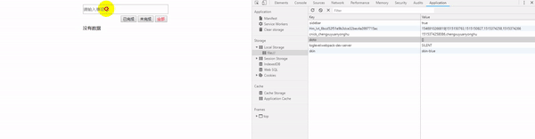

### Vue todo_list
- 状态：
  - 全部
  - 未完成
  - 已完成

- 操作:
  - 添加
  - 删除
  - 编辑
- 存储localStorage

#### files
```
├── app.js             
├── components.js
├── todo.css
├── todo.html      
├── todo_list.gif
└── vue.js    
```

#### Run

##### simple
```
直接打开todo.html即可
```

##### Docker
```
docker build -t todo_list .
docker-compose up -d
#访问8002端口  http://xxxx:8002/todo.html
```
##### K8S
```
#build镜像，push到harbor
docker build -t todo_list .
docker tag <tag_name> <harbor_address>/yanghongfei/todo_list:v0.1
docker push <harbor_address>/yanghongfei/todo_list:v0.1
#k8s部署启动 ingress等
kubectl create -f todo_list.yaml
#访问,https://<ingress_domain>/todo.html
```


#### Rendering

